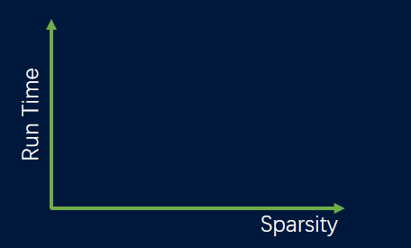
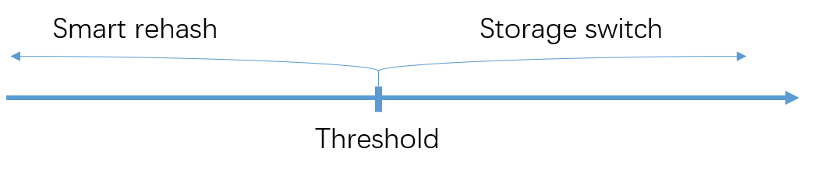
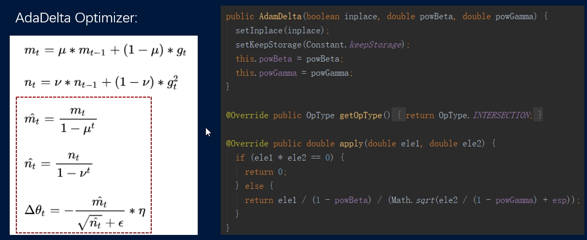

# math2
A math lib optimized for sparse calculation. 

The math lib is a self-developed new subject separated from previous Angel version. Other project such as mlcore, parameter server and Angel serving are based math lib. The math lib is designed for sparse calculation. The main features of math lib as following:

### 1. Smart rehash
We adopt a fast typed hash map (no general type) to store sparse vectors and matrix. As the calculation going, the vectors is getting more and more dense. As a result, many rehash emerged. To reduce the amount of rehash, we specification an operation type to every operator. 
- the `union` type represents the output index is the union of the input indices; 
- the `intersection` type indicates the output index is the intersection of the input indices; 
- the `all` type denotes the result would be dense. Once we known the operator type, we can use it reduce rehash greatly. 

| operator type | example | rehash |
| ---- | ---- | ---- | 
| `union` | $x + y$ | choose out = coeff * (\|indices x\|+\|indices of y\|) , at most once rehash |
| `intersection` | $x * y$ | choose out = min(\|indices x\|, \|indices of y\|), no rehash |
| `all` | $x - 1$ | to dense, no rehash |

For example, if we know the operator type is `intersection`, the result size is no larger than the smaller input, so we can pre-allocate space to prevent rehash. 

### 2. Storage aware (Storage siwtch)
As mentioned in Smart rehash, the vectors is getting denser as the calculation going. If the sparsity exceeds a certain threshold, we choose to switch the sparse storage to dense one to promote the calculation efficiency. 

There is a relationship between Storage aware and Smart rehash.

If the sparsity the below some threshold, we choose Smart rehash, and over the threshold, choose Storage siwtch.

### 3. Executor-expression mechanism

Expression folding is an excellent feature for reducing function calls and iteration. Unfortunately, there is no expression folding in our math lib. However, we provide an executor-expression mechanism to allow use do expression folding manually. 

for example, we can fold the expression in the red box manually to reduce calculation.

At last, User friendly. User can create vector and matrix for factory classes `VFactory` and `MFactory` respectively. After the vector and matrix created, they can be used as if you are doing mathematical deduction without worrying about the data type and storage.
